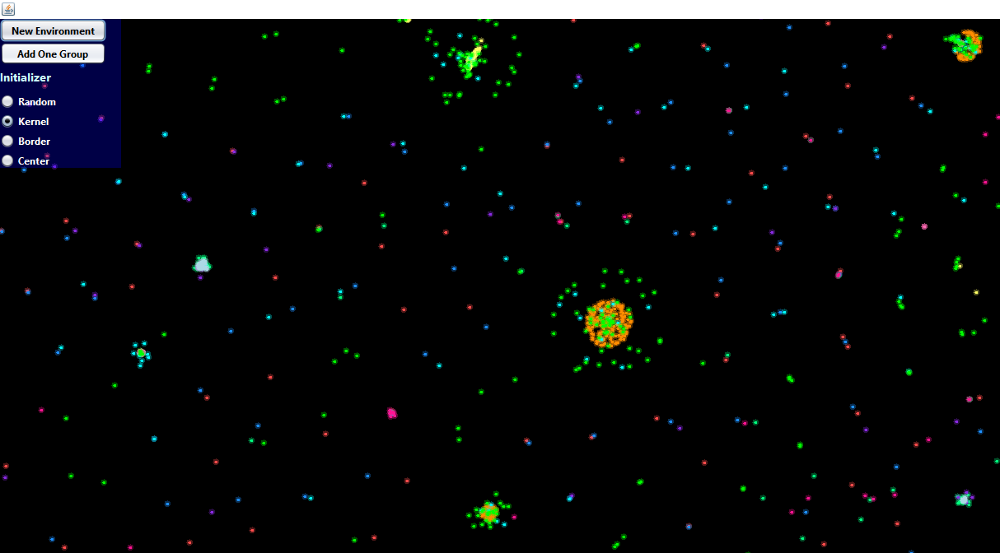
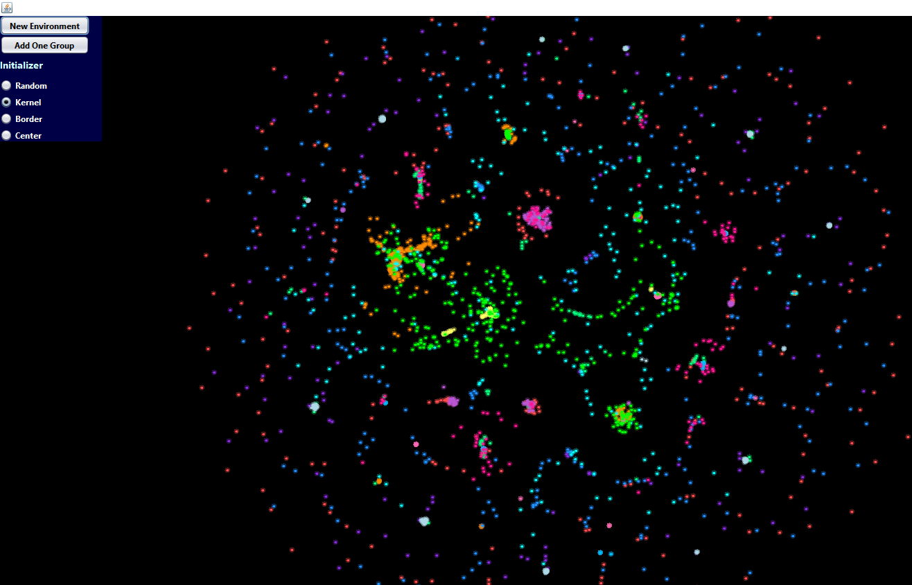

# Particlellife (Java + Swing)

**Particlellife** is a particle-based simulation inspired by the idea of emergent behavior from simple rules of interaction.
Built with 💛 **Java + Swing**, it simulates particles that attract and repel each other based on custom force rules.

Particles self-organize into mesmerizing clusters, swarms, and dynamic patterns — all driven by simple forces.

## 🔍 How It Works

* Particles have **types** (Red, Orange, Yellow, Green, Blue, Violet)
* Each type has attraction/repulsion settings toward others
* The system updates positions using basic physics and force accumulation
* UI powered by **Java Swing** for real-time rendering

## 🧠 Inspiration

This project is based on the original concept by:

* [**Jeffrey Ventrella**](https://ventrella.com/Clusters/) – *Clusters*
* [**Tom Mohr**](https://particle-life.com/) – *Particle Life*

Massive props to both for the mind-blowing concept of digital particle societies 💥

## 🛠️ Tech Stack

* **Language:** Java 17+
* **UI:** Swing

## 🚀 Run It

Just clone the repo and run the main class:

```bash
directly from your IDE (IntelliJ, Eclipse, etc.)directly from your IDE (IntelliJ, Eclipse, etc.)
```

## 📸 Preview


# -- 



